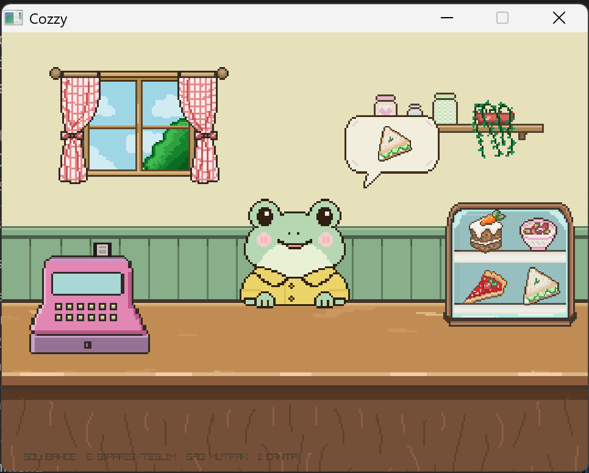
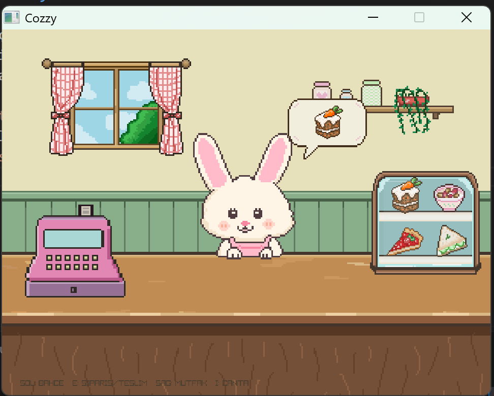

# Cozzy

Cozzy, oyuncunun bahçede malzeme topladığı, mutfakta tarif hazırladığı ve tezgahtaki hayvan müşterilere sipariş teslim ettiği piksel sanat tarzında bir oyundur. Oyun C++ ve raylib ile geliştirilmiştir.

 &nbsp;

## Özellikler

- Bahçe, tezgâh ve mutfak arasında geçiş
- Tavşan, kapibara, kirpi ve kurbağaya sipariş hazırlama
- Malzeme toplama ve envanter yönetimi
- Tarif birleştirme ve teslim tepkileri
- Toplama, yemek hazırlama ve teslim için ses efektleri

## Tarifler

| Malzemeler | Yemek | Müşteri |
|---|---|---|
| Buğday + havuç | Havuçlu kek | Tavşan |
| Buğday + çilek | Granola | Kapibara |
| Buğday + elma | Elmalı turta | Kirpi |
| Buğday + salatalık | Sandviç | Kurbağa |

## Kontroller

| Tuş | İşlev |
|---|---|
| `E` | Sipariş al, malzeme topla, malzeme seç veya yemeği teslim et |
| `Sol` / `Sağ` | Tezgâhta sahne değiştir; mutfakta malzeme seç |
| `Space` | Seçilen malzemelerle tarif hazırla |
| `Q` | Mutfak malzeme seçimlerini temizle |
| `B` | Mutfaktan tezgâha dön |
| `F` | Bahçede boş yere yeniden ek |
| `I` | Envanteri aç/kapat |
| `F1` | Bahçe engel kutularını göster/kapat |
| `F3` | Toplama sesini dinle |
| `F4` | Yemek hazırlama sesini dinle |
| `F5` | Teslim sesini dinle |

Sipariş sırası tavşan, kapibara, kirpi ve kurbağadır. Bir sipariş teslim edildikten sonra tezgahtaki yeni müşteriden `E` ile siparişi al.

## Derleme ve çalıştırma

Gerekenler: CMake 3.15 veya üstü, C++11 destekli bir derleyici ve ilk yapılandırmada raylib kaynağını indirmek için internet bağlantısı.

Proje kök klasöründe PowerShell veya terminal açıp çalıştır:

```powershell
cmake -S . -B build
cmake --build build
.\build\cozzy.exe
```

Oyunu proje kök klasöründen başlat; görseller ve sesler `assets/` altındaki göreli yollarla yüklenir. CMake, raylib 5.5'i ilk yapılandırmada otomatik indirip derleme için hazırlar.

## Proje yapısı

```text
assets/          Oyun görselleri ve sesleri
assets/sesler/   WAV efektleri ve pop/hihi seslerini üreten Python betiği
main.cpp         Oyun döngüsü, kaynak yükleme ve ses tetikleme
bahce.cpp/.h     Bahçe sahnesi ve hareket/toplama
tezgah.cpp/.h    Tezgâh sahnesi, müşteriler ve teslim
mutfak.cpp/.h    Mutfak sahnesi ve tarif hazırlama
oyun_verileri.h  Sahne, müşteri, yemek ve envanter verileri
KULLANIM.txt     Tuşlar ve kısa oyun rehberi
CMakeLists.txt   CMake yapılandırması
```

## Ses dosyaları

- Bahçede ürün toplama: `assets/sesler/pop_yeni.wav`
- Tarif hazırlama: `assets/sesler/hihi_yeni.wav`
- Sipariş teslimi: `assets/sesler/classic_diririm.wav`

`assets/sesler/olustur.py`, `pop_yeni.wav` ve `hihi_yeni.wav` dosyalarını yeniden üretir. Betik NumPy gerektirir. `classic_diririm.wav` ayrı bir WAV dosyasıdır.
